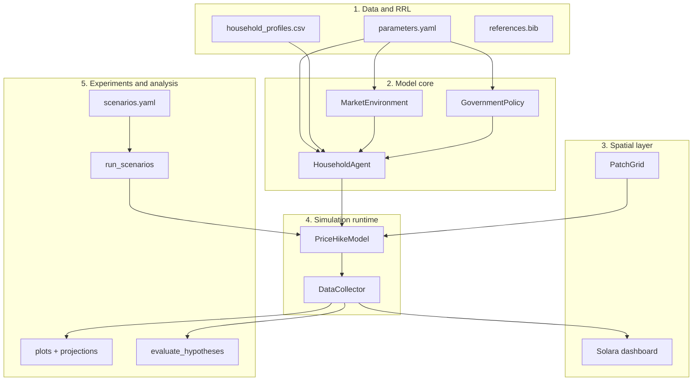

# War-Induced Fuel Price Surge Simulation — Philippines

An agent-based model (ABM) of how war-driven global oil shocks propagate
into food, utilities, and transport costs and reduce household buying
power across **rural and urban Filipino communities**.

- **Stack:** Python 3.12 + [Mesa 3](https://mesa.readthedocs.io/) + Solara dashboard
- **Time step:** one simulated month
- **Spatial layer:** 20×20 patch grid with a central urban core and rural periphery
- **Agents:** 150 synthetic Filipino households calibrated to PSA FIES marginals
- **Outcome:** color-graded houses (green / orange / red) shift class as their buying power changes; live charts track the cost-of-living index, class population, stress flags, and rural-vs-urban gap

> Built to operationalize the proposal *“Modeling War-Induced Fuel Price
> Surges and Their Effects on Food, Utilities, Transportation Costs, and
> Buying Power in the Philippines.”*

---

## Quick start

```bash
pip install -r requirements.txt

# Headless smoke run (baseline + 40% shock + 40% shock with gov=2)
python -m experiments.smoke_run

# Full scenario matrix (writes CSVs to output/runs/)
python -m experiments.run_scenarios

# Analysis: figures, projections, H0/H1 verdict, markdown report
python -m analysis.generate_report

# Live NetLogo-style dashboard
solara run pricehike_abm/app.py
# then open http://127.0.0.1:8765/
```

---

## ABM workflow



---

## Component reference

### Component 1 — Data and RRL layer

| File | Purpose |
|------|---------|
| [`data/parameters.yaml`](data/parameters.yaml) | All coefficients. Each value carries `source` and `note` for academic auditability. |
| [`data/household_profiles.csv`](data/household_profiles.csv) | 150 synthetic households sampled from PSA FIES marginals (deterministic, seeded). |
| [`data/generate_profiles.py`](data/generate_profiles.py) | One-shot generator that rebuilds the CSV when parameters change. |
| [`data/references.bib`](data/references.bib) | BibTeX bibliography (PSA FIES, PIDS 2026, BSP, Mesa 3 JOSS, ...). |

Key citations driving the calibration:

| Parameter | Default | Source |
|-----------|---------|--------|
| Fuel pass-through | 0.35 | [PIDS 2026 — Albert et al.](https://www.pids.gov.ph/details/news/press-releases/oil-price-surge-may-push-1-34-million-filipinos-into-poverty-pids) |
| Food pass-through | 0.25 | PIDS Rice & Fuel poverty study |
| Utilities pass-through | 0.35 | BSP discussion paper on oil shocks |
| Transport pass-through | 0.70 | LTFRB fare petitions / DOE pump tracker |
| Rural food share multiplier | 1.12 | PIDS 2026 (+1.5pp rural poverty vs +0.9pp urban) |
| Low-income food share | 0.50 | PSA FIES 2023; PIDS notes poor allocate ~57% to food chain |
| Population: low/middle/high | 40 / 40 / 20 | PSA FIES 2023 deciles |

### Component 2 — `HouseholdAgent`

File: [`pricehike_abm/agents/household.py`](pricehike_abm/agents/household.py)

Each agent owns the attributes from proposal Section 4.1 (income class,
expenditure shares, location, employment, vehicle, savings, government
support eligibility). Every month it:

1. Reads the domestic fuel multiplier from the environment.
2. Applies pass-through to food, utilities, and transport (location- and
   vehicle-aware on the pass-through *delta*, never on the baseline).
3. Adjusts effective income via employment sensitivity and any government
   transfer it qualifies for.
4. Computes `buying_power = effective_income − (food + utilities + transport)`.
5. Stages cuts when budget runs short: savings → non-essential → transport
   → utilities (bill stress) → food (food at risk).
6. Updates `effective_class` (`high` / `middle` / `low`) using a 3-band
   threshold with hysteresis to avoid month-to-month flicker.
7. Updates `class_progress` ∈ [0, 1] used by the visualisation layer to
   interpolate red → orange → green continuously.

### Component 3 — Environment

File: [`pricehike_abm/environment/market.py`](pricehike_abm/environment/market.py)

Holds the system-level price drivers (oil shock %, four pass-through
coefficients) and exposes `domestic_fuel_multiplier`:

```
domestic_fuel_multiplier = 1 + oil_shock_pct/100 * fuel_pass_through
```

All fields are mutable so the Solara sliders can drive the simulation
live.

### Component 4 — Patches

File: [`pricehike_abm/environment/patches.py`](pricehike_abm/environment/patches.py)

A `PatchGrid` wraps a Mesa `MultiGrid` and labels each cell `urban` or
`rural`. Urban cells form a square core; rural cells form the periphery.
Households are placed on cells matching their declared `location`, so the
dashboard shows two visually distinct zones.

### Component 5 — Government policy

File: [`pricehike_abm/policies/government.py`](pricehike_abm/policies/government.py)

Three response levels (proposal Section 4.2):

| Level | Effect |
|------:|--------|
| 0 | No response. |
| 1 | Moderate — targeted income transfer + 20% fuel subsidy for low-income or transport workers flagged as `gov_support_eligible`. |
| 2 | Strong — broader targeted transfer (low + middle + transport workers) with a `_targeting_scale` that gives middle-income only half the support, mirroring PIDS' warning that blanket subsidies favour higher-income groups. |

Policy effects only activate when `oil_shock_pct > 0`.

### Component 6 — `PriceHikeModel`

File: [`pricehike_abm/model.py`](pricehike_abm/model.py)

The Mesa model loads parameters, spawns agents from the CSV, places them
on the patch grid, and wires the DataCollector. Activation uses
`AgentSet.do("step")` (simultaneous) so every household reacts to the
same monthly prices.

### Component 7 — Metrics

File: [`pricehike_abm/metrics.py`](pricehike_abm/metrics.py)

Reporters wired into `DataCollector`:

- Time-series: COL index, mean buying power, class counts (high/middle/low), food-at-risk %, bill-stress %, mean spend per category, buying power by income class, rural vs urban buying power, current oil shock and fuel multiplier.
- Per-agent: income class, effective class, location, employment type, buying power, ratio, category spend, stress flags, class progress.

### Component 8 — NetLogo-style dashboard

Files: [`pricehike_abm/app.py`](pricehike_abm/app.py), [`pricehike_abm/viz/grid.py`](pricehike_abm/viz/grid.py), [`pricehike_abm/viz/charts.py`](pricehike_abm/viz/charts.py), [`pricehike_abm/viz/colors.py`](pricehike_abm/viz/colors.py)

Run with `solara run pricehike_abm/app.py`.

- **Sidebar controls:** oil shock %, fuel / food / utilities / transport pass-through sliders, government response dropdown, speed (ticks/sec), Play / Pause / Step / Reset.
- **Live monitors:** step, oil shock %, COL index, mean buying power, high/middle/low counts, food-at-risk %, bill stress %, rural and urban buying power.
- **World view:** rural (pale green) and urban (light gray) patches with house markers coloured by `class_progress` along a red → orange → green gradient. Hover for per-household details.
- **Five live charts** rebuilt every tick: stacked class population, COL index, mean buying power by income class, stress indicators, rural-vs-urban gap.

### Component 9 — Experiments

Files: [`experiments/scenarios.yaml`](experiments/scenarios.yaml), [`experiments/run_scenarios.py`](experiments/run_scenarios.py), [`experiments/smoke_run.py`](experiments/smoke_run.py)

Eight scenarios covering:

- Baseline (no shock).
- +20%, +40% (PIDS-current), +60% (severe) shocks.
- +40% with government levels 1 and 2.
- +60% with government level 2 (stress test).
- +40% with reduced pass-through (government absorbs more at the pump).

Each run exports `{scenario}_model.csv` (monthly metrics), `{scenario}_agents.csv` (per-agent final snapshot), and a global `summary.csv`.

### Component 10 — Analysis and projections

Files: [`analysis/plots.py`](analysis/plots.py), [`analysis/projections.py`](analysis/projections.py), [`analysis/evaluate_hypotheses.py`](analysis/evaluate_hypotheses.py), [`analysis/generate_report.py`](analysis/generate_report.py)

`python -m analysis.generate_report` produces:

- Nine presentation-ready PNGs in [`output/figures/`](output/figures/) (class migration per scenario, COL by scenario, buying power by class, rural-vs-urban gap, policy effect, dose-response curve).
- Forward projections, scenario deltas, and inequality metrics in [`output/projections/`](output/projections/).
- [`output/analysis_report.md`](output/analysis_report.md) with summary table, hypothesis verdict, headline figures, implications, and limitations.

### Component 11 — Hypothesis evaluation

H1 is supported when all three criteria pass:

1. **Dose-response:** higher shocks produce monotonically higher COL, lower mean buying power, and more low-class households across `S0 → S1 → S2 → S3`.
2. **Policy mitigation:** at +40% shock, government level 2 yields higher buying power, fewer low-class households, and lower COL than no response.
3. **Distributional impact:** at +60% shock, low-income households lose a larger percentage of their buying power than high-income households.

The current run reports **H1 supported** on all three (see
`output/projections/hypothesis_verdict.json`).

---

## Rubric mapping

| Rubric criterion | Weight | Deliverables in this repo |
|------------------|-------:|---------------------------|
| Model design & implementation | 20% | Components 2–7 documented with RRL citations; agent step() flow above; thresholds with hysteresis; parameters in YAML only |
| Simulation proper | 35% | NetLogo-style live dashboard with sliders, speed, play/step/reset; emergent class migration visible on the grid; reproducible seed |
| Analysis of results | 35% | Nine presentation figures, projections, inequality metrics, automated H1 verdict, markdown report with implications and limitations |
| Communication | 10% | This README + [`docs/PRESENTATION_GUIDE.md`](docs/PRESENTATION_GUIDE.md) with demo script and anticipated Q&A |

---

## Project structure

```
pricehike_simulation/
├── README.md
├── requirements.txt
├── .gitignore
├── docs/
│   └── PRESENTATION_GUIDE.md
├── data/
│   ├── parameters.yaml
│   ├── household_profiles.csv
│   ├── generate_profiles.py
│   └── references.bib
├── pricehike_abm/
│   ├── agents/household.py
│   ├── environment/market.py
│   ├── environment/patches.py
│   ├── policies/government.py
│   ├── viz/grid.py
│   ├── viz/charts.py
│   ├── viz/colors.py
│   ├── config.py
│   ├── model.py
│   ├── metrics.py
│   └── app.py
├── experiments/
│   ├── scenarios.yaml
│   ├── run_scenarios.py
│   └── smoke_run.py
├── analysis/
│   ├── plots.py
│   ├── projections.py
│   ├── evaluate_hypotheses.py
│   └── generate_report.py
└── output/
    ├── runs/           # per-scenario CSVs + summary
    ├── figures/        # PNGs for slides
    ├── projections/    # deltas, inequality, forward projections, verdict JSON
    └── analysis_report.md
```

---

## Limitations

- Households are synthetic profiles drawn from FIES-style marginals, not the raw FIES microdata; attribute correlations are limited to those wired in the generator.
- Partial-equilibrium model: no producer responses, no second-round wage effects, no remittance dynamics.
- Pass-through coefficients are single point estimates from PIDS; sensitivity analysis with bootstrap ranges would tighten the conclusions.
- Class migration uses a rule-based threshold with hysteresis; a richer specification could use Markov or survival models calibrated to longitudinal FIES panels.
- The model converges in one month under a constant shock; time variation in the dashboard comes from user interaction with the sliders, not from intrinsic dynamics.

## License

Educational project; no external license is currently attached.

## References

See [`data/references.bib`](data/references.bib).
